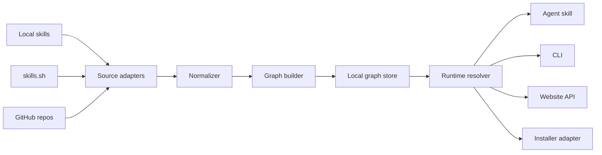
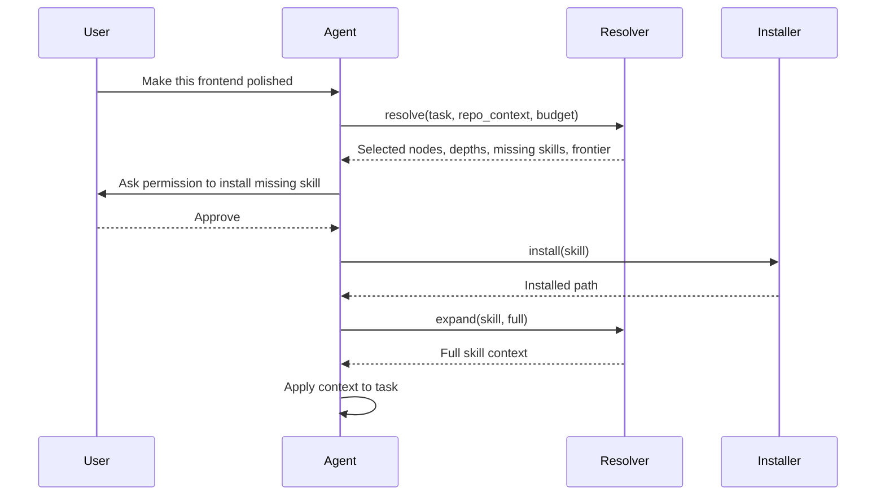

# Architecture

SkillGraph Resolver should be designed as a local-first graph and resolver that can later power a hosted website.

## System Overview

## Components

### Source Adapters

Adapters fetch skill metadata from different sources:

- Local Codex skill directories.
- Local Claude skill directories.
- Agent Skills standard directories.
- skills.sh marketplace pages or APIs.
- GitHub repositories.

Adapters should not execute skill scripts. They only read metadata and text.

### Normalizer

The normalizer converts heterogeneous skills into a common `SkillNode`.

It should extract:

- Name.
- Description.
- Source.
- Runtime compatibility.
- Install command.
- Tags.
- Trigger phrases.
- Referenced artifacts.
- License if available.
- Trust metadata if available.

### Graph Builder

The graph builder creates nodes and edges.

Edge sources:

- Explicit `skillgraph.yaml` metadata.
- Existing marketplace categories.
- Filesystem paths.
- Tags and trigger terms.
- Embedding similarity.
- LLM-assisted classification.
- Human-reviewed edits.

### Local Graph Store

The first version should use a simple local file store:

- `skillgraph.lock.json` for indexed nodes and sources.
- `skillgraph.edges.json` for edges.
- `skillgraph.cache/` for fetched remote metadata.

A future version could use SQLite for better search, caching, and migrations.

### Runtime Resolver

The resolver is the core product.

Responsibilities:

- Take a user task and optional repo context.
- Retrieve candidate skills.
- Add ancestors, prerequisites, and complements.
- Remove duplicates and detect conflicts.
- Assign context depth under budget.
- Return an expansion frontier.
- Explain the selected graph path.

### Installer Adapter

The installer adapter wraps install mechanisms:

- `npx skills add`.
- Codex skill installer.
- Claude Code-compatible install paths.
- Git clone or direct download.

It must ask for user approval before remote install.

### Agent Skill

The agent skill teaches agents how to use the resolver:

1. Call `skillgraph resolve` before specialized work.
2. Start with shallow context.
3. Ask before installing remote skills.
4. Expand nodes as the task becomes clearer.
5. Load newly installed `SKILL.md` files immediately.
6. Explain the selected path to the user.

### Hosted Website

The website should be a later surface over the graph.

It can provide:

- Visual exploration.
- Skill maps by domain.
- Recommended bundles.
- Relationship review.
- Trust and provenance display.

The website should not be required for the local-first MVP.

## Data Flow

### Indexing Flow

### Runtime Flow

## Local-First Principle

The first implementation should be usable without a hosted service.

Reasons:

- Agents operate inside local projects.
- Repository context may be private.
- Users need control over remote skill installation.
- A local prototype can validate the core mechanism quickly.

## Extension Points

- New source adapters.
- Custom trust policy.
- Organization-maintained graph overlays.
- Runtime-specific installers.
- Hosted graph sync.
- Human review UI for inferred edges.

