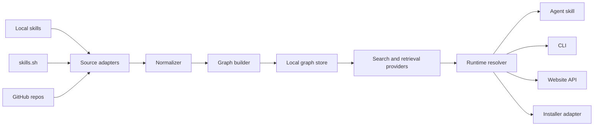
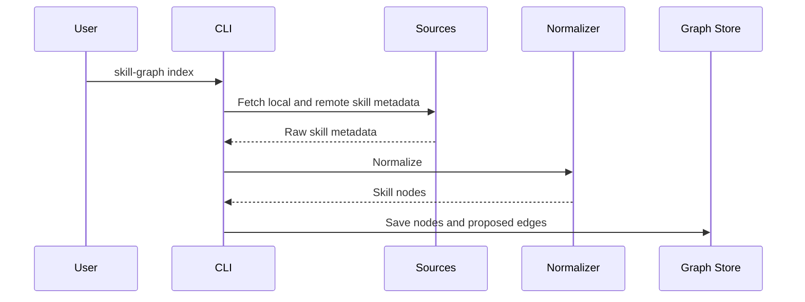
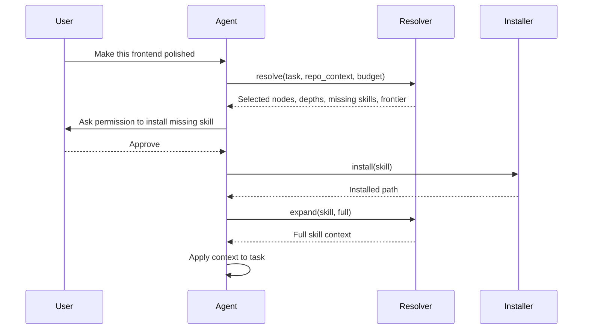

# Architecture

skill-graph should be designed as a local-first graph and resolver that can later power a hosted website.

## System Overview

## Components

### Source Adapters

Adapters fetch skill metadata from different sources:

- Local Codex skill directories.
- Local Claude skill directories.
- Agent Skills standard directories.
- skills.sh marketplace pages or APIs.
- GitHub repositories.

Adapters should not execute skill scripts. They only read metadata and text.

### Normalizer

The normalizer converts heterogeneous skills into a common `SkillNode`.

It should extract:

- Name.
- Description.
- Source.
- Runtime compatibility.
- Install command.
- Tags.
- Trigger phrases.
- Referenced artifacts.
- License if available.
- Trust metadata if available.

### Graph Builder

The graph builder creates nodes and edges.

Edge sources:

- Explicit `skill-graph.yaml` metadata.
- Existing marketplace categories.
- Filesystem paths.
- Tags and trigger terms.
- Embedding similarity.
- LLM-assisted classification.
- Human-reviewed edits.

The current implementation can propose embedding-similarity edges with `skill-graph edges suggest`. These suggestions include provenance and `reviewStatus: proposed`; they are not written into canonical graph files automatically.

### Local Graph Store

The first version should use a simple local file store:

- `.skill-graph/index.json` for indexed nodes and sources.
- `.skill-graph/edges.json` for edges.
- `.skill-graph/last-resolution.json` for explainability.
- `.skill-graph/loaded-context.json` for expanded context tracking.
- `.skill-graph/embeddings.json` for optional local semantic vectors.
- `.skill-graph/cache/` for fetched remote metadata.

A future version could use SQLite for better search, caching, and migrations.

### Search and Retrieval Providers

Search should sit between the graph store and resolver.

The resolver should depend on a provider interface instead of one scoring implementation. This allows skill-graph to improve retrieval without changing graph expansion, conflict detection, context depth assignment, or explanations.

Planned providers:

- Deterministic lexical provider for the v0.1 baseline.
- BM25 provider for local lexical ranking, backed by MiniSearch.
- Remote metadata provider for cached skills.sh candidates from the official Skills CLI.
- Optional semantic provider for embedding similarity.
- Hybrid provider that fuses BM25, semantic, and graph-aware signals.

The provider output should include:

- candidate node id;
- score or rank;
- matched fields;
- retrieval source, such as lexical, BM25, semantic, remote, or graph expansion;
- explanation metadata for resolver output.

Semantic providers must be optional. Local semantic search uses a saved `.skill-graph/embeddings.json` file and embeds only normalized skill text plus the current query. Any provider that uploads task text, repository context, or private skill content requires explicit human approval before use.

The current implementation ships deterministic lexical, BM25, semantic, and hybrid providers. BM25 is the default for `search` and `resolve`; lexical remains available as `--strategy lexical` for relevance comparisons. Semantic search is enabled only after `skill-graph embeddings index` writes a local vector index. Hybrid retrieval fuses BM25 and lexical rankings by default and adds semantic rankings automatically when embeddings exist.

The default real semantic provider is `qwen3-local`, which shells out to a local Python helper using `sentence-transformers` and `Qwen/Qwen3-Embedding-0.6B`. The deterministic embedding provider exists for tests and demos so CI and local verification do not need model weights.

The semantic index is rebuildable derived state. skill-graph checks saved vector hashes against current normalized node text before using semantic results.

Remote discovery is implemented as a dry-run adapter over `npx skills find`. It parses remote candidates, caches them, and can include them as `installed: false` graph nodes, but it does not install or execute remote skill content.

### Runtime Resolver

The resolver is the core product.

Responsibilities:

- Take a user task and optional repo context.
- Retrieve candidate skills.
- Add ancestors, prerequisites, and complements.
- Remove duplicates and detect conflicts.
- Assign context depth under budget.
- Return an expansion frontier.
- Explain the selected graph path.

The current resolver can use `l2` operational summaries as a middle context layer. When a selected full skill would exceed the budget, skill-graph downgrades from `l3` to `l2` before falling back to `l1`. Local skills can also expose safe relative Markdown links as `l4` artifacts for on-demand expansion.

Expanded context layers are tracked locally so an agent can report what it actually loaded instead of only what the resolver recommended.

### Installer Adapter

The installer adapter wraps install mechanisms:

- `npx skills add`.
- Codex skill installer.
- Claude Code-compatible install paths.
- Git clone or direct download.

It must ask for user approval before remote install.

### Agent Skill

The agent skill teaches agents how to use the resolver:

1. Call `skill-graph resolve` before specialized work.
2. Start with shallow context.
3. Ask before installing remote skills.
4. Expand nodes as the task becomes clearer.
5. Load newly installed `SKILL.md` files immediately.
6. Explain the selected path to the user.

### Hosted Website

The website should be a later surface over the graph.

It can provide:

- Visual exploration.
- Skill maps by domain.
- Recommended bundles.
- Relationship review.
- Trust and provenance display.

The website should not be required for the local-first MVP.

## Data Flow

### Indexing Flow

### Runtime Flow

## Local-First Principle

The first implementation should be usable without a hosted service.

Reasons:

- Agents operate inside local projects.
- Repository context may be private.
- Users need control over remote skill installation.
- A local prototype can validate the core mechanism quickly.

## Extension Points

- New source adapters.
- Custom trust policy.
- Organization-maintained graph overlays.
- Runtime-specific installers.
- Hosted graph sync.
- Human review UI for inferred edges.

